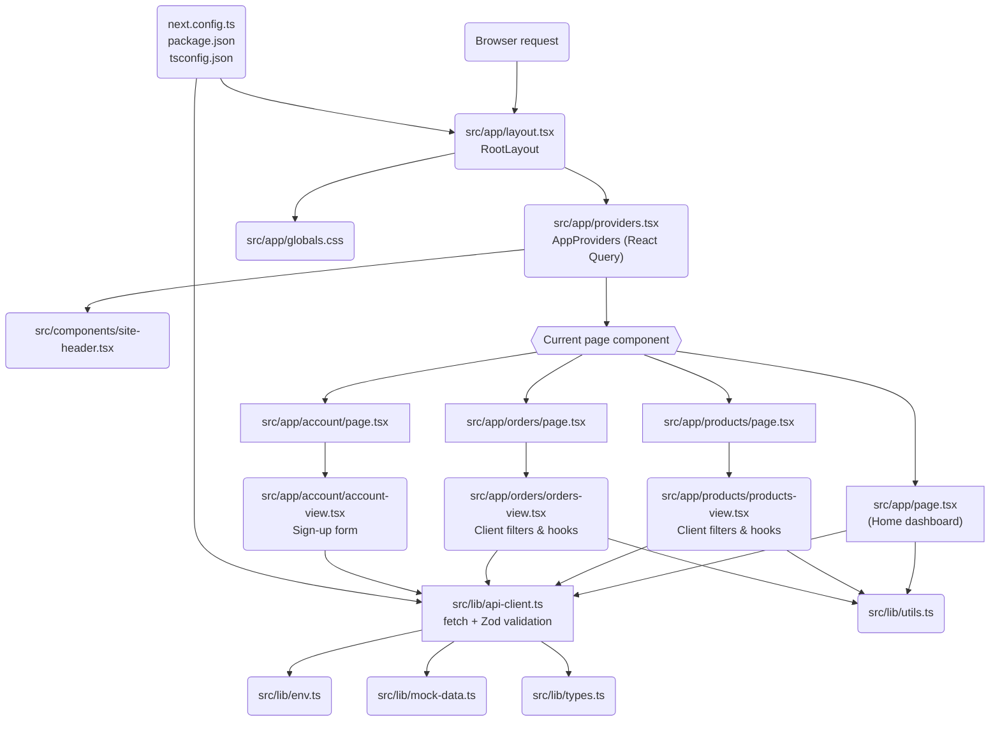

# Boofshop Console Code Walkthrough

Welcome! This guide explains what each key file in the project does, how the pieces connect, and how to reason about them even if you are brand new to Next.js. Keep it handy while you explore or extend the app.

---

## 1. Project at a Glance

| Path | What it is | Why it matters |
| --- | --- | --- |
| `src/app/layout.tsx` | Global page wrapper | Sets up fonts, layout chrome, shared providers, and metadata for every route. |
| `src/app/providers.tsx` | React Query context | Creates the query client and (in dev) enables the React Query Devtools panel. |
| `src/components/site-header.tsx` | Navigation bar | Shows the top navigation and highlights the active page. |
| `src/app/page.tsx` | Home page | Server component that fetches dashboard data and renders the landing metrics. |
| `src/app/orders/page.tsx` + `orders-view.tsx` | Orders feature | Server component fetches initial orders, client component adds filters and live updates. |
| `src/app/products/page.tsx` + `products-view.tsx` | Products feature | Same split as orders: server-side fetch + interactive client view. |
| `src/app/account/page.tsx` + `account-view.tsx` | Account onboarding | Server wrapper renders a client form that posts sign-up data to the Go API. |
| `src/lib/api-client.ts` | Data fetching helpers | Centralizes all calls to the backend API and handles mock fallbacks with Zod validation. |
| `src/lib/env.ts` | Environment helpers | Reads environment variables that control API URL and mock mode. |
| `src/lib/mock-data.ts` | Built-in sample data | Mock responses used when the real API is unreachable or when mock mode is forced. |
| `src/lib/types.ts` | Shared TypeScript models | Describes the shapes of products, orders, and health responses. |
| `src/lib/utils.ts` | Formatting utilities | Helpers for consistent currency and date formatting. |
| `src/app/globals.css` | Global styles | Loads Tailwind CSS, defines base colors/fonts, and applies the background look. |
| `next.config.ts` | Next.js configuration | Tells Next how to bundle TanStack Query packages for both Node and the browser. |
| `tsconfig.json` | TypeScript settings | Enables path aliases (`@/*`), strictness, and Next.js tooling integration. |
| `package.json` | Project manifest | Declares scripts (`dev`, `build`, `lint`), dependencies, and tooling versions. |
| `postcss.config.mjs` | CSS tooling | Hooks Tailwind CSS into the PostCSS pipeline. |

---

## 2. How Rendering Works

1. **Request arrives**: Next.js handles the URL (e.g., `/`, `/products`, `/orders`).
2. **`layout.tsx` runs first**: Every page is wrapped in `RootLayout`, which sets the `<html>` and `<body>` markup, injects fonts, and renders the `SiteHeader`, `<main>`, and footer.
3. **`AppProviders` wraps the page**: Inside the layout, `AppProviders` creates a TanStack Query client (with sensible defaults) and exposes it via React context. In development, it also shows the devtools panel so you can inspect queries.
4. **Server components fetch initial data**:
   - `src/app/page.tsx` runs on the server. It calls `getHealth`, `getProducts`, and `getOrders` in parallel. The data arrives before HTML is sent to the browser, so the page loads with content already filled in.
   - `src/app/orders/page.tsx` and `src/app/products/page.tsx` also run on the server. They fetch the starting datasets, then render client components (`OrdersView`, `ProductsView`) inside a `<Suspense>` boundary (handy if you later add streaming or loading states).
   - `src/app/account/page.tsx` runs on the server and renders `AccountView`, a client component that powers the sign-up form.
5. **Client components add interactivity**: Files marked with `"use client"` (like `products-view.tsx`, `orders-view.tsx`, `account/account-view.tsx`, and `site-header.tsx`) run in the browser. They reuse the same React Query hooks which now have cached server data, enabling filters, search, form submissions, and live refetching without full reloads.

Because Fetch requests happen through the helpers in `src/lib/api-client.ts`, the app stays consistent: validation, fallback logic, and error handling live in one place.

---

## 3. Deep Dive by Area

### 3.1 Layout & Navigation

- **`src/app/layout.tsx`**
  - Imports the Geist font families so typography is consistent across the app.
  - Sets the `metadata` object, naming the app "Boofshop Experience Console" and describing its purpose. Next.js uses this for `<title>` tags and SEO defaults.
  - Wraps everything in `AppProviders` and renders the `SiteHeader`, a centered `<main>` container, and a footer with product copy.

- **`src/components/site-header.tsx`**
  - Marked as a client component because it uses hooks (`usePathname`).
  - Defines nav items (Overview, Products, Orders, Account) and highlights the active route using the current pathname.
  - Uses the `clsx` helper to compute class names cleanly.

- **`src/app/globals.css`**
  - Imports Tailwind via the new `@import "tailwindcss";` syntax and sets theme variables.
  - Defines light/dark color palettes and gives the body a gradient background and base font stack.

### 3.2 Data Fetching & State

- **`src/lib/api-client.ts`** (core of data access)
  - Reads the base URL and mock-mode flag from `src/lib/env.ts`.
  - Uses `fetch` to hit the backend (`/health`, `/api/v1/products`, `/api/v1/orders`, `/api/v1/users`).
  - Wraps read-only network calls with `safeRequest`. If mock mode is enabled or the real API fails, it returns the static datasets from `src/lib/mock-data.ts` instead of crashing the UI.
  - Exports `createUser`, which POSTs sign-up payloads and returns a mock user object when the backend is unavailable.
  - Validates every response with Zod schemas (`productSchema`, `orderSchema`, `healthSchema`, `userSchema`) so invalid payloads are caught early.

- **`src/app/providers.tsx`**
  - Declares `"use client"` because React Query's hooks run in the browser.
  - Initializes a `QueryClient` with defaults: queries stay fresh for 30 seconds, re-fetching on window focus is off, and failed queries retry once.
  - In dev mode, renders `<ReactQueryDevtools>` so you can inspect cached queries.

- **`src/lib/mock-data.ts`**
  - Generates realistic-looking products, orders, and health status using `date-fns` to build timestamps relative to "now".
  - Keeps the UI usable even without a backend, speeding up beginner experimentation.

- **`src/lib/utils.ts`**
  - Wrapper functions for currency and date formatting using `Intl`. They ensure consistent display across components.

- **`src/lib/types.ts`**
  - TypeScript interfaces mirror the Zod schemas, providing strong typing for products, orders, users, and the API helpers.

### 3.3 Feature Pages

- **`src/app/page.tsx` (Home dashboard)**
  - Gathers data from `getHealth`, `getProducts`, and `getOrders` using `Promise.all` for efficiency.
  - Computes summary metrics (active products, fulfilled MRR, recent orders) and renders cards, capability descriptions, backend status, delivery checklist, and a recent orders table.
  - Uses helper sub-components (`MetricCard`, `CapabilityCard`, `StatusBadge`) defined inline for clarity.

- **`src/app/products/page.tsx` + `products-view.tsx`**
  - Server component loads products once. Client component manages state: search input, status filter buttons, and a manual "Refresh" that triggers React Query's `refetch`.
  - Each product card shows metadata (price, tags, inventory) and uses `StatusPill` + `LinkButton` helper components for consistent styles.

- **`src/app/orders/page.tsx` + `orders-view.tsx`**
  - Mirrors the products pattern. Filters by order status and shows counts + formatted totals.
  - Displays a fallback row when no orders match and signals live syncing while React Query refetches.

- **`src/app/account/page.tsx` + `account-view.tsx`**
  - Server page wraps the client-only sign-up experience in a `<Suspense>` fallback.
  - Client form calls `createUser` with React Query `useMutation`, shows API progress, and surfaces success or error messages with the created user data.

### 3.4 Configuration & Tooling

- **`next.config.ts`**
  - Ensures Turbopack knows how to transpile the modern builds of `@tanstack/react-query` and its devtools. This avoids resolution errors discussed in the build fix.
  - Adds aliases so both server and client bundles point at the same modern entry files.

- **`tsconfig.json`**
  - Enables strict TypeScript checks (`strict: true`) to catch bugs early.
  - Sets up the `@/*` alias so imports like `@/lib/api-client` resolve to `src/lib/api-client`.
  - Integrates with Next.js via the `next` TypeScript plugin.

- **`package.json`**
  - Scripts:
    - `npm run dev`: start a local dev server with Turbopack.
    - `npm run build`: create a production bundle.
    - `npm run start`: run the production server.
    - `npm run lint` / `npm run format`: run Biome (linter/formatter).
  - Declares runtime dependencies (Next.js, React, TanStack Query, Zod, Tailwind 4, etc.) and dev tools (TypeScript, Biome).

- **`postcss.config.mjs`**
  - Minimal config that loads Tailwind's PostCSS plugin so Tailwind directives compile into CSS.

- **`next-env.d.ts`**
  - Auto-generated file that wires TypeScript definitions for Next.js. Leave it in place; Next manages it during upgrades.

---

## 4. Flow of Data and Components

> Tip: Mermaid diagrams render in many Markdown viewers (including GitHub). If yours does not, read the arrows as "A depends on B" or "A renders B".

---

## 5. Best Practices to Keep in Mind

- **Keep server and client code separate.** Server components (no `"use client"`) should fetch data and pass it down. Client components handle browser-only features like state, event handlers, or hooks that require the DOM.
- **Centralize API access.** Add new endpoints to `src/lib/api-client.ts` so validation, mock fallbacks, and error handling stay consistent.
- **Reuse the React Query client.** When creating new client views, call `useQuery` or `useMutation` inside components wrapped by `AppProviders` so caching just works.
- **Use mutations for writes.** Wrap POST/PUT/DELETE operations (like `createUser`) in `useMutation` to get loading, success, and error states for free.
- **Lean on TypeScript + Zod.** Update both the interface in `types.ts` and the schema in `api-client.ts` when API responses change. It keeps runtime and compile-time checks in sync.
- **Respect the styling system.** Use Tailwind utility classes and global theme tokens established in `globals.css` to maintain visual consistency.
- **Environment-driven behavior.** Configure API URLs with `NEXT_PUBLIC_API_BASE_URL`. Toggle the mock mode with `NEXT_PUBLIC_USE_API_MOCKS="true"` when you want to develop offline.

---

## 6. Where to Go Next

1. **Experiment locally**: run `npm run dev`, tweak mock data, and watch the UI update.
2. **Add a new feature page**: follow the pattern `page.tsx` (server fetch) + `feature-view.tsx` (client interactivity) and plug it into the header navigation.
3. **Wire up a real backend**: point `NEXT_PUBLIC_API_BASE_URL` to your live API, ensure the responses satisfy the Zod schemas, and remove mocks once confident.
4. **Extend testing/tooling**: integrate unit tests or end-to-end tests to cover new interactions, using the strong typing and mocks already provided.

You now have a mental map of how the app pieces fit together. Happy building!
